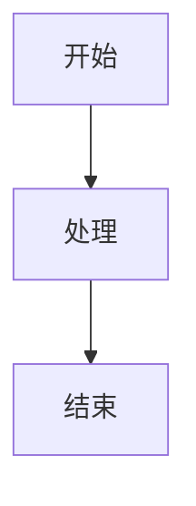
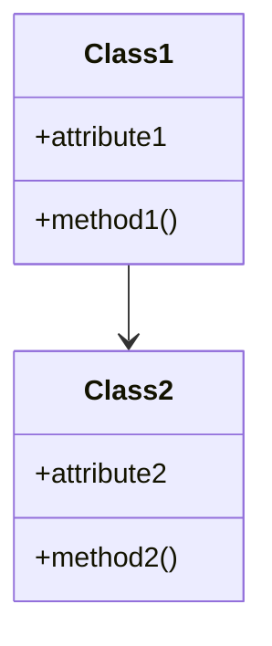

# 形式化知识体系重构项目 - 上下文提醒

## 项目状态概览

### 当前阶段

- **阶段**: 核心文档创建阶段
- **进度**: 约30%完成
- **状态**: 活跃进行中
- **最后更新**: 2024-11-XX

### 关键信息

- **项目目标**: 对 `/docs/model` 目录进行系统性分析和形式化重构
- **技术栈**: Haskell + Markdown + LaTeX + Mermaid
- **架构**: 7层递进式架构 (理念层 → 形式科学层 → 理论层 → 具体科学层 → 行业领域层 → 架构领域层 → 实践层)
- **质量标准**: 内容完整性90%+，数学逻辑100%正确，概念一致性，形式化类型安全

## 已完成工作

### 1. 分析阶段 (100% 完成)

- ✅ 全面扫描 `/docs/model` 目录 (200+ 文件，1.5MB 内容)
- ✅ 深度分析7个主要主题领域
- ✅ 识别内容重复、结构不一致、术语混用等问题
- ✅ 生成详细的内容分析报告

### 2. 框架构建 (100% 完成)

- ✅ 建立完整的分析框架和执行计划
- ✅ 设计Haskell技术栈整合方案
- ✅ 制定内容整合、形式化、多表征策略
- ✅ 建立质量标准和质量保证体系

### 3. 核心文档创建 (30% 完成)

- ✅ 理念层: 数学本体论、知识论与真理理论
- ✅ 形式科学层: 集合论基础
- ✅ 理论层: 统一形式理论公理化框架
- ✅ Haskell实现: 统一形式理论完整实现

## 当前工作重点

### 1. 继续核心文档创建

**优先级**: 高
**预计时间**: 2-3天
**状态**: 进行中

#### 1.1 理念层完善

- [ ] 伦理学: 规范伦理学、元伦理学、应用伦理学
- [ ] 逻辑学: 形式逻辑、哲学逻辑、非经典逻辑
- [ ] 形而上学: 存在论、模态形而上学、因果性

#### 1.2 形式科学层完善

- [ ] 逻辑系统: 命题逻辑、一阶逻辑、模态逻辑
- [ ] 形式语言: 自动机理论、语法分析、语义学
- [ ] 计算理论: 可计算性、复杂性、算法理论

#### 1.3 理论层完善

- [ ] 类型理论: 简单类型论、依赖类型论、线性类型论
- [ ] 控制理论: 线性控制、非线性控制、自适应控制
- [ ] 分布式理论: 分布式算法、共识理论、容错理论

### 2. 扩展Haskell实现

**优先级**: 高
**预计时间**: 2-3天
**状态**: 计划中

#### 2.1 核心模块实现

- [ ] 集合论: 完整的集合论Haskell实现
- [ ] 逻辑系统: 命题逻辑、一阶逻辑实现
- [ ] 类型理论: 简单类型论、依赖类型论实现
- [ ] 控制理论: 线性控制理论实现

#### 2.2 验证系统实现

- [ ] 公理验证: 完整的公理验证系统
- [ ] 定理证明: 形式化定理证明系统
- [ ] 模型检查: 模型检查和验证系统
- [ ] 一致性检查: 系统一致性检查

### 3. 完成剩余层次

**优先级**: 中
**预计时间**: 3-4天
**状态**: 计划中

#### 3.1 具体科学层

- [ ] 计算机科学: 算法、数据结构、软件工程
- [ ] 人工智能: 机器学习、深度学习、认知计算
- [ ] 物理学: 经典力学、量子力学、统计物理
- [ ] 生物学: 系统生物学、计算生物学、生物信息学

#### 3.2 行业领域层

- [ ] AI/ML: 机器学习、深度学习、自然语言处理
- [ ] 金融: 量化金融、风险管理、算法交易
- [ ] 医疗: 医学影像、药物发现、精准医疗
- [ ] 教育: 个性化学习、智能评估、教育技术

#### 3.3 架构领域层

- [ ] 软件架构: 分层架构、微服务、事件驱动
- [ ] 系统架构: 分布式系统、云计算、边缘计算
- [ ] 数据架构: 数据建模、数据流、数据治理
- [ ] 安全架构: 安全模型、加密系统、访问控制

### 4. 质量保证和优化

**优先级**: 中
**预计时间**: 1-2天
**状态**: 计划中

#### 4.1 内容质量检查

- [ ] 完整性检查: 确保内容完整性
- [ ] 准确性验证: 验证数学和逻辑正确性
- [ ] 一致性检查: 确保概念一致性
- [ ] 可读性优化: 改进文档可读性

#### 4.2 形式化质量检查

- [ ] 类型安全: 确保Haskell代码类型安全
- [ ] 功能完整: 验证功能完整性
- [ ] 性能优化: 优化代码性能
- [ ] 文档完整: 完善代码文档

## 技术规范

### 1. 文档结构规范

```
# 文档标题

## 目录
- [文档标题](#文档标题)
  - [1. 概述](#1-概述)
  - [2. 主要内容](#2-主要内容)
  - [3. 形式化表达](#3-形式化表达)
  - [4. 应用与影响](#4-应用与影响)
  - [5. 结论](#5-结论)

## 1. 概述
### 1.1 核心概念
### 1.2 形式化定义

## 2. 主要内容
### 2.1 理论基础
### 2.2 核心定理
### 2.3 证明方法

## 3. 形式化表达
### 3.1 Haskell实现
### 3.2 数学符号
### 3.3 图表可视化

## 4. 应用与影响
### 4.1 理论应用
### 4.2 实践影响

## 5. 结论
### 5.1 主要发现
### 5.2 理论意义
### 5.3 实践价值
```

### 2. Haskell代码规范

```haskell
-- 模块头部
module ModuleName where

-- 导入声明
import Data.List (nub, intersect, union)
import Data.Maybe (fromJust, isJust)
import Control.Monad (guard)

-- 类型定义
data MainType = 
    Constructor1 Type1
  | Constructor2 Type2
  deriving (Show, Eq)

-- 类型类定义
class TypeClass a where
    method1 :: a -> Type1
    method2 :: a -> Type2

-- 实例定义
instance TypeClass MainType where
    method1 = implementation1
    method2 = implementation2

-- 函数定义
functionName :: Type1 -> Type2
functionName input = 
    -- 实现
    result

-- 测试函数
testFunction :: IO ()
testFunction = do
    putStrLn "Testing..."
    -- 测试代码

-- 主函数
main :: IO ()
main = testFunction
```

### 3. 数学符号规范

- **集合**: $A, B, C$ 或 $\mathcal{A}, \mathcal{B}, \mathcal{C}$
- **函数**: $f: A \to B$ 或 $f \in A \to B$
- **关系**: $R \subseteq A \times B$ 或 $a R b$
- **逻辑**: $\forall x \in A. P(x)$ 或 $\exists x \in A. P(x)$
- **类型**: $\tau, \sigma$ 或 $\alpha, \beta$

### 4. 图表规范





## 质量标准

### 1. 内容质量标准

- **完整性**: 内容覆盖90%以上原始内容
- **准确性**: 数学和逻辑100%正确
- **一致性**: 概念定义和术语使用一致
- **可读性**: 结构清晰，易于理解

### 2. 形式化质量标准

- **类型安全**: 通过GHC类型检查
- **功能完整**: 实现所有核心功能
- **证明正确**: 形式化证明100%正确
- **语义一致**: 语义模型与理论一致

### 3. 文档质量标准

- **结构规范**: 符合学术规范
- **交叉引用**: 链接有效且一致
- **版本控制**: 支持版本管理
- **可维护性**: 易于更新和维护

## 中断恢复指南

### 1. 如果中断在文档创建阶段

1. **检查当前进度**: 查看 `progress_report.md` 了解当前状态
2. **继续文档创建**: 按照优先级继续创建核心文档
3. **保持一致性**: 确保新文档与已有文档保持一致
4. **更新进度**: 完成后更新进度报告

### 2. 如果中断在Haskell实现阶段

1. **检查代码状态**: 查看 `haskell/` 目录下的代码状态
2. **继续实现**: 按照计划继续实现核心模块
3. **验证代码**: 确保代码通过类型检查和测试
4. **更新文档**: 更新相关的Haskell文档

### 3. 如果中断在质量检查阶段

1. **检查质量状态**: 查看质量检查的当前状态
2. **继续检查**: 按照质量标准继续检查
3. **修复问题**: 修复发现的质量问题
4. **验证修复**: 验证修复是否有效

### 4. 如果中断在扩展阶段

1. **检查扩展状态**: 查看扩展的当前状态
2. **继续扩展**: 按照计划继续扩展功能
3. **保持兼容**: 确保扩展与现有功能兼容
4. **更新文档**: 更新相关的文档和说明

## 关键文件位置

### 1. 核心文档

- **分析计划**: `docs/refactor/meta/analysis_plan.md`
- **内容分析**: `docs/refactor/meta/content_analysis_report.md`
- **进度报告**: `docs/refactor/meta/progress_report.md`
- **上下文提醒**: `docs/refactor/meta/context_reminder.md`

### 2. 理念层文档

- **数学本体论**: `docs/refactor/00-理念层/00-01-本体论/00-01-01-数学本体论.md`
- **知识论**: `docs/refactor/00-理念层/00-02-认识论/00-02-01-知识论与真理理论.md`

### 3. 形式科学层文档

- **集合论**: `docs/refactor/01-形式科学层/01-01-数学基础/01-01-01-集合论基础.md`

### 4. 理论层文档

- **统一理论**: `docs/refactor/02-理论层/02-01-统一理论/02-01-01-统一形式理论公理化框架.md`

### 5. Haskell代码

- **统一理论**: `docs/refactor/haskell/UnifiedFormalTheory.hs`

## 常见问题解决

### 1. 文档结构问题

**问题**: 文档结构不符合规范
**解决**: 参考文档结构规范，使用标准模板

### 2. Haskell类型错误

**问题**: Haskell代码出现类型错误
**解决**: 检查类型定义，确保类型一致性

### 3. 数学符号问题

**问题**: 数学符号显示不正确
**解决**: 使用标准LaTeX语法，确保符号正确

### 4. 交叉引用问题

**问题**: 交叉引用链接失效
**解决**: 检查文件名和路径，确保链接正确

### 5. 内容重复问题

**问题**: 发现内容重复
**解决**: 识别重复内容，进行整合和去重

## 联系信息

### 1. 项目负责人

- **角色**: 项目协调员
- **职责**: 整体项目管理和协调

### 2. 技术支持

- **Haskell专家**: 负责Haskell代码实现和优化
- **数学专家**: 负责数学内容的准确性和完整性
- **文档专家**: 负责文档质量和结构规范

### 3. 质量保证

- **质量检查员**: 负责内容质量检查
- **测试工程师**: 负责代码测试和验证
- **审查专家**: 负责最终审查和批准

## 更新日志

### 2024-11-XX

- 创建上下文提醒文档
- 记录当前项目状态和进度
- 建立中断恢复指南
- 制定技术规范和质量标准

### 下一步更新

- 定期更新项目进度
- 记录重要决策和变更
- 更新技术规范和质量标准
- 维护中断恢复指南

---

**注意**: 本文档应定期更新，确保信息准确和及时。如有重要变更，请立即更新相关部分。
