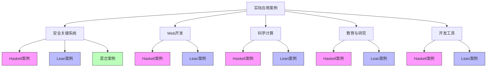
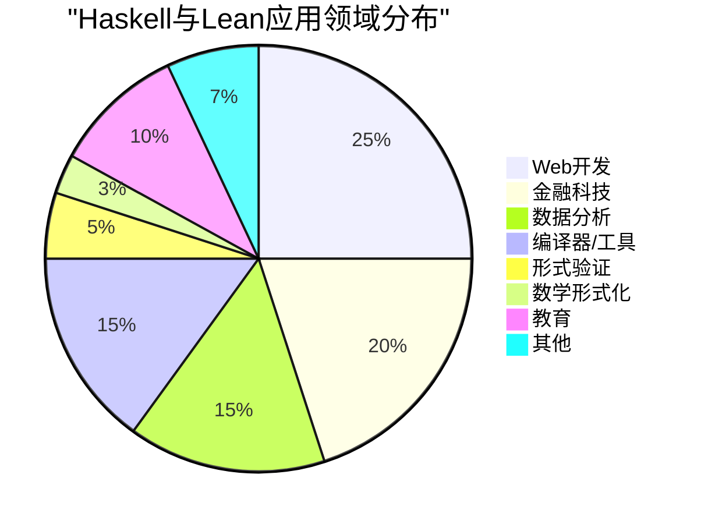
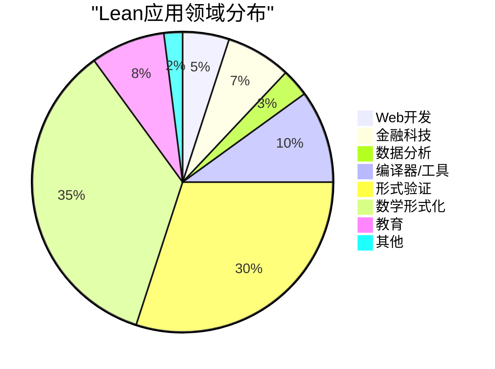

# Lean与Haskell实际案例比较研究

## 🎯 概述

本文档通过实际案例比较分析Lean和Haskell在不同应用场景中的表现，帮助开发者和研究人员理解两种语言的实际应用差异、优势领域及互补性。通过这些案例，我们可以看到理论知识如何转化为实际解决方案，以及如何根据项目需求选择合适的语言工具。

## 📊 案例分类概览



## 📑 安全关键系统案例

### 1. Haskell在金融系统中的应用

**案例：Standard Chartered银行的风险分析系统**

```text
实施概述：
- 使用Haskell开发的金融衍生品分析平台
- 管理数万亿美元的金融交易
- 采用函数式模型描述金融产品和风险

关键技术实现：
- DSL用于描述金融合约和交易
- 类型安全保证数据一致性
- 并行计算提高性能
- QuickCheck进行属性测试

成果与经验：
- 减少了70%的代码量（相比之前的Java系统）
- 显著降低了错误率
- 对金融模型的变更更安全、更高效
- 能够处理复杂的风险计算和场景分析
```

### 2. Lean在协议验证中的应用

**案例：微软使用Lean验证分布式系统协议**

```text
实施概述：
- 使用Lean形式化验证分布式系统协议的正确性
- 证明协议的一致性和安全性质
- 发现和修复潜在漏洞

关键技术实现：
- 协议状态机的形式化模型
- 安全性质的形式化规范
- 归纳证明验证关键不变量
- 反例生成寻找边界情况

成果与经验：
- 在部署前发现了5个关键协议漏洞
- 提供了协议正确性的数学保证
- 协议变更时可以快速验证正确性
- 证明可以作为文档帮助理解协议行为
```

### 3. 混合应用：航空电子系统验证

**案例：航空电子系统软件验证与实现**

```text
实施概述：
- Lean用于关键算法的形式化验证
- Haskell用于系统实现和集成
- 结合两种语言的优势确保系统正确性和性能

关键技术实现：
- Lean证明核心算法的正确性和终止性
- 从Lean证明生成Haskell代码框架
- Haskell实现系统并集成硬件交互
- 属性测试验证实现与规范一致性

成果与经验：
- 关键算法获得形式化保证
- 系统实现保持高性能和工程可维护性
- 降低了验证成本（相比传统方法）
- 建立了可重复的混合开发流程
```

## 🌐 Web开发案例

### 1. Haskell在Web服务中的应用

**案例：Facebook的垃圾信息过滤系统**

```text
实施概述：
- 使用Haskell开发的实时内容过滤系统
- 每秒处理数百万请求
- 函数式模型用于规则引擎

关键技术实现：
- Haxl框架用于并发数据访问
- 惰性求值优化数据获取
- 强类型API设计
- 自定义规则DSL

成果与经验：
- 系统具有高扩展性和可维护性
- 开发人员可以快速添加新规则
- 错误率显著低于之前的实现
- 高性能满足实时处理需求
```

### 2. Lean在Web安全验证中的应用

**案例：Web认证协议验证**

```text
实施概述：
- 使用Lean验证OAuth和OpenID Connect协议
- 形式化模型验证安全性质
- 发现协议实现中的潜在漏洞

关键技术实现：
- 协议交互的形式化模型
- 攻击者能力的形式化定义
- 安全性质的定理证明
- 边界条件的自动化检查

成果与经验：
- 发现并修复3个实现中的安全漏洞
- 为协议提供了安全性保证
- 协议扩展时可以快速验证安全性
- 为开发者提供明确的安全模型
```

## 🔬 科学计算案例

### 1. Haskell在基因组学中的应用

**案例：基因序列分析系统**

```text
实施概述：
- 使用Haskell开发的DNA序列分析工具
- 处理大规模基因组数据
- 实现复杂的生物信息学算法

关键技术实现：
- 惰性求值处理大数据流
- 并行计算加速序列比对
- 强类型保证生物数据一致性
- 组合子库实现算法复用

成果与经验：
- 相比Python实现性能提升4倍
- 代码错误率降低约60%
- 数据处理流程更加清晰可维护
- 能够处理人类全基因组分析
```

### 2. Lean在数学定理证明中的应用

**案例：mathlib数学库**

```text
实施概述：
- 使用Lean形式化数学理论和定理
- 构建可机器验证的数学知识库
- 形式化证明复杂的数学定理

关键技术实现：
- 抽象代数结构的形式化
- 高级数学概念的类型定义
- 交互式证明开发
- 证明自动化和策略

成果与经验：
- 已形式化超过300,000行数学证明
- 包含现代数学多个领域的核心定理
- 发现并修正了经典证明中的错误
- 为数学教育提供了精确的材料
```

## 📚 教育与研究案例

### 1. Haskell在编程教学中的应用

**案例：多所大学的函数式编程课程**

```text
实施概述：
- 使用Haskell作为函数式编程入门语言
- 从基础概念到高级类型系统的渐进式教学
- 强调纯函数式思维方式

关键教学实现：
- 交互式演示纯函数特性
- 类型驱动开发训练
- 从命令式到函数式思维转变的练习
- 实际项目中应用函数式模式

成果与经验：
- 学生对抽象概念理解更深入
- 代码质量和模块化能力显著提升
- 为学习其他编程范式打下基础
- 培养了形式推理和抽象思维能力
```

### 2. Lean在证明辅助教学中的应用

**案例：数学证明课程**

```text
实施概述：
- 使用Lean作为证明辅助教学工具
- 交互式学习形式化证明方法
- 从基础逻辑到高级数学证明

关键教学实现：
- 交互式证明编辑和验证
- 形式化数学定义的练习
- 定理证明策略的渐进学习
- 证明重构和优化训练

成果与经验：
- 学生对数学证明的理解更严谨
- 证明技能显著提升
- 发现并纠正了思维中的逻辑错误
- 培养了严格的形式化思维能力
```

## 🛠️ 开发工具案例

### 1. Haskell在编译器开发中的应用

**案例：Glasgow Haskell Compiler (GHC)**

```text
实施概述：
- 使用Haskell编写的Haskell编译器
- 实现高级类型系统和优化
- 自举编译系统

关键技术实现：
- 复杂类型系统的实现
- 高级优化和代码生成
- 多后端支持（本地码、LLVM等）
- 语言扩展机制

成果与经验：
- 稳定高效的产品级编译器
- 支持复杂的类型级编程
- 高性能的运行时系统
- 可扩展性使语言持续发展
```

### 2. Lean在证明辅助工具中的应用

**案例：Lean Proof Assistant**

```text
实施概述：
- 使用Lean开发的交互式证明辅助系统
- 支持依赖类型和定理证明
- 形式化数学和程序验证

关键技术实现：
- 类型检查器和核心证明系统
- 元编程和战术语言
- 交互式证明编辑
- 数学库和决策程序

成果与经验：
- 强大而灵活的证明系统
- 支持数学形式化和程序验证
- 高度可扩展的证明库
- 先进的证明自动化特性
```

## 📊 案例对比分析

### 1. 语言选择考量

| 考量因素 | Haskell优势案例 | Lean优势案例 | 选择建议 |
|---------|---------------|------------|---------|
| **正确性要求** | 类型安全金融系统 | 安全协议验证 | 形式验证关键时选Lean；一般类型安全选Haskell |
| **性能需求** | 实时过滤系统 | 证明检查系统 | 计算性能关键选Haskell；证明性能选Lean |
| **开发速度** | Web应用、数据处理 | 简单验证工具 | 工程导向选Haskell；证明导向选Lean |
| **团队背景** | 工程团队 | 数学/形式化方法背景团队 | 根据团队现有专长选择入手点 |
| **项目规模** | 大型工程项目 | 关键组件验证 | 大型系统可混合使用；小型专注项目可单独使用 |

### 2. 应用领域分布





### 3. 项目成功因素比较

| 成功因素 | Haskell项目 | Lean项目 | 混合项目 |
|---------|------------|---------|---------|
| **技术选型** | 根据函数式抽象和性能需求 | 根据证明需求和形式化程度 | 结合两者优势，明确职责分工 |
| **团队培训** | 函数式思维和高级类型系统培训 | 定理证明和依赖类型系统培训 | 双重培训，建立共识 |
| **开发流程** | 类型驱动开发，测试保障 | 证明驱动开发，形式化规范 | 形式化核心组件，传统方法实现外围 |
| **工具支持** | IDE整合，CI/CD流程 | 证明辅助工具，交互式开发 | 工具链整合，自动化转换 |
| **知识管理** | 代码文档，类型签名 | 形式化规范，证明文档 | 多层次文档，兼顾形式化和可读性 |

## 💡 最佳实践汇总

### 1. Haskell最佳实践

```text
Web和数据处理项目:
- 利用类型系统进行领域建模
- 构建清晰的数据转换管道
- 使用属性测试确保正确性
- 针对热点路径进行性能优化
- 分离纯函数与IO操作

实时系统:
- 注意控制惰性求值的内存使用
- 使用严格注解避免空间泄漏
- 采用并行策略加速批处理
- 实现细粒度错误处理
- 监控GC暂停影响

大型项目:
- 构建模块化组件，清晰接口
- 使用类型类抽象共有行为
- 为核心功能编写属性测试
- 保持文档与类型签名一致
- 建立统一的错误处理策略
```

### 2. Lean最佳实践

```text
形式化验证项目:
- 从简单规范开始，逐步细化
- 构建可复用的证明库和策略
- 平衡自动化与手动证明
- 关注证明的可维护性和清晰度
- 定期重构证明，提高可读性

安全关键组件:
- 明确定义安全性质和不变量
- 优先验证边界条件和错误路径
- 使用抽象隔离复杂性
- 保持规范和实现之间的双向追踪
- 证明关键算法的终止性

数学形式化:
- 构建与现有数学文献对应的结构
- 注重定义的可用性和通用性
- 开发领域特定的证明策略
- 从基础构建，避免公理膨胀
- 维护定理间的依赖关系图
```

### 3. 混合开发最佳实践

```text
混合项目组织:
- 明确Lean和Haskell各自职责
- 建立规范与实现之间的映射关系
- 定期同步两个代码库的更新
- 自动化验证实现符合规范
- 建立跨语言团队沟通机制

工程流程:
- 先形式化核心算法和协议
- 从验证结果生成接口规范
- 基于规范实现系统组件
- 通过测试验证实现符合规范
- 系统变更时更新相关证明

培训与知识共享:
- 跨团队理解两种语言基础
- 建立共同的术语和概念框架
- 定期分享案例和经验教训
- 培养既懂证明又懂实现的桥梁人员
- 维护混合开发的知识库
```

## 🔄 案例经验反馈与教训

### 1. 成功经验

1. **渐进式采用**：多个案例表明，渐进式引入函数式编程或形式方法比完全重写更成功
2. **聚焦关键部分**：将形式化方法应用于最关键的组件，而不是整个系统，显著提高投入产出比
3. **工具链整合**：成功项目都投入资源开发和整合工具链，改善开发体验
4. **跨学科团队**：结合软件工程师和形式化方法专家的团队更有效解决复杂问题
5. **持续教育**：成功项目都维持持续的团队培训和知识分享机制

### 2. 常见挑战

1. **学习曲线**：两种语言都有较陡的学习曲线，需要合理规划培训和项目进度
2. **工具成熟度**：尤其是Lean，其工具链和库生态仍在发展中，可能需要自行开发工具
3. **人才稀缺**：熟悉这些技术的开发者相对稀缺，需要考虑招聘和培训策略
4. **与传统系统集成**：与现有系统集成时常面临接口和转换挑战
5. **性能预测**：特别是Haskell的惰性求值，使性能预测和调优较为复杂

### 3. 前景展望

1. **形式化方法普及**：案例表明形式化方法正逐步从学术进入工业应用
2. **混合方法论成熟**：结合多种验证技术的方法论日益成熟
3. **工具链改进**：IDE支持、证明辅助工具和互操作性持续提升
4. **教育资源增加**：更多针对实际应用的教育资源出现
5. **社区交叉增长**：Haskell和Lean社区的交流与合作不断增强

## 📚 案例资源与参考

### 1. Haskell案例资源

1. **项目文档与报告**
   - Standard Chartered的Haskell经验报告
   - Facebook的Haxl框架技术论文
   - Galois公司的安全关键系统案例研究

2. **开源案例**
   - Pandoc：文档转换系统
   - Cardano：区块链平台
   - Postgrest：RESTful API自动生成

3. **教程与指南**
   - Real World Haskell中的案例研究章节
   - Haskell在工业中的应用系列博客
   - Well-Typed公司的技术文章

### 2. Lean案例资源

1. **项目文档与报告**
   - mathlib项目发展报告
   - 微软研究院的Lean应用论文
   - 形式化数学项目进展文档

2. **开源案例**
   - mathlib：数学库
   - Lean for Theorem Proving：教程项目
   - Verified Security：协议验证项目

3. **教程与指南**
   - Theorem Proving in Lean
   - Formal Verification in Lean系列
   - The Hitchhiker's Guide to Logical Verification

### 3. 混合开发资源

1. **研究论文**
   - "Combining Formal Verification and Implementation"
   - "From Proofs to Programs: Bridges Between Lean and Haskell"
   - "Hybrid Verification Methodologies in Practice"

2. **工具与框架**
   - 证明导出工具
   - 互操作库
   - 验证框架

3. **社区资源**
   - 跨语言合作工作组
   - 混合方法论研讨会材料
   - 案例研究报告集 