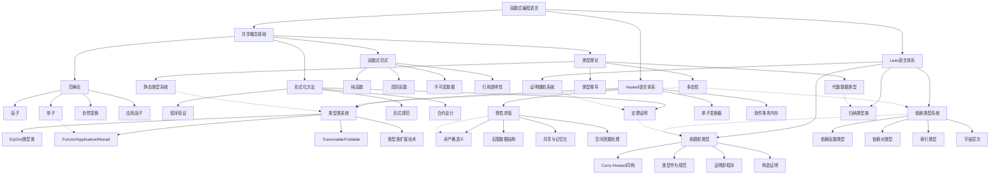
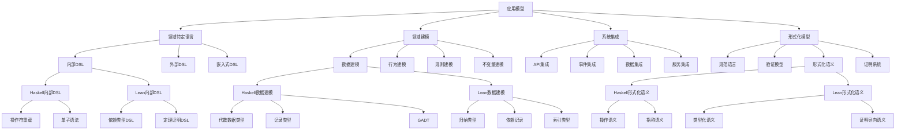

# Lean与Haskell概念关系图谱

## 🎯 概述

本文档通过可视化图表展示Lean和Haskell编程语言的核心概念及其关联性，帮助理解两种语言的理论基础、设计模式、应用模型和执行流的相互关系。

## 📊 核心概念层次图

## 🔄 设计模式关联图

```mermaid
graph TD
    %% 设计模式主分类
    PATTERNS[设计模式]
    PATTERNS --> FUNC[函数式模式]
    PATTERNS --> ARCH[架构模式]
    PATTERNS --> TYPE[类型级模式]
    PATTERNS --> VERIFICATION[验证模式]

    %% 函数式模式细分
    FUNC --> F1[单子模式]
    FUNC --> F2[函子模式]
    FUNC --> F3[应用函子模式]
    FUNC --> F4[遍历模式]
    FUNC --> F5[折叠模式]

    %% 单子模式的语言实现
    F1 --> F1_H[Haskell单子实现]
    F1 --> F1_L[Lean单子实现]
    F1_H --> F1_H1[IO单子]
    F1_H --> F1_H2[State单子]
    F1_H --> F1_H3[Reader单子]
    F1_H --> F1_H4[错误处理单子]
    F1_L --> F1_L1[IO单子]
    F1_L --> F1_L2[ST单子]
    F1_L --> F1_L3[状态单子]
    F1_L --> F1_L4[证明单子]

    %% 架构模式细分
    ARCH --> A1[分层架构]
    ARCH --> A2[事件驱动架构]
    ARCH --> A3[管道-过滤架构]
    ARCH --> A4[函数式反应式编程]

    %% 分层架构的语言实现
    A1 --> A1_H[Haskell分层实现]
    A1 --> A1_L[Lean分层实现]
    A1_H --> A1_H1[单子变换器堆栈]
    A1_H --> A1_H2[模块化组织]
    A1_L --> A1_L1[依赖类型分层]
    A1_L --> A1_L2[证明辅助层次]

    %% 类型级模式细分
    TYPE --> T1[幻影类型模式]
    TYPE --> T2[类型族模式]
    TYPE --> T3[类型级编程]
    TYPE --> T4[类型安全DSL]

    %% 类型安全DSL的语言实现
    T4 --> T4_H[Haskell类型安全DSL]
    T4 --> T4_L[Lean类型安全DSL]
    T4_H --> T4_H1[GADT实现]
    T4_H --> T4_H2[高级类型约束]
    T4_L --> T4_L1[依赖类型DSL]
    T4_L --> T4_L2[证明生成DSL]

    %% 验证模式细分
    VERIFICATION --> V1[类型驱动验证]
    VERIFICATION --> V2[属性测试模式]
    VERIFICATION --> V3[定理证明模式]
    VERIFICATION --> V4[形式合约模式]

    %% 定理证明模式的语言实现
    V3 --> V3_H[Haskell定理证明]
    V3 --> V3_L[Lean定理证明]
    V3_H --> V3_H1[LiquidHaskell]
    V3_H --> V3_H2[证明辅助库]
    V3_L --> V3_L1[内置证明系统]
    V3_L --> V3_L2[证明策略]
```

## 📈 执行流与控制流关联图

```mermaid
graph TD
    %% 执行流主分类
    EXECUTION[执行流与控制流]
    EXECUTION --> EVAL[求值策略]
    EXECUTION --> CONTROL[控制结构]
    EXECUTION --> DATA[数据流处理]
    EXECUTION --> CONCURRENCY[并发模型]

    %% 求值策略细分
    EVAL --> E1[惰性求值]
    EVAL --> E2[严格求值]
    EVAL --> E3[混合求值]

    %% 惰性求值的语言实现
    E1 --> E1_H[Haskell惰性求值]
    E1 --> E1_L[Lean中模拟惰性]
    E1_H --> E1_H1[默认非严格语义]
    E1_H --> E1_H2[无限数据处理]
    E1_H --> E1_H3[记忆化与共享]
    E1_L --> E1_L1[Thunk实现]
    E1_L --> E1_L2[延迟计算]

    %% 严格求值的语言实现
    E2 --> E2_H[Haskell严格求值]
    E2 --> E2_L[Lean严格求值]
    E2_H --> E2_H1[严格注解]
    E2_H --> E2_H2[严格数据类型]
    E2_L --> E2_L1[默认严格语义]
    E2_L --> E2_L2[正则化规则]

    %% 控制结构细分
    CONTROL --> C1[模式匹配]
    CONTROL --> C2[单子控制]
    CONTROL --> C3[递归控制]
    CONTROL --> C4[错误处理]

    %% 模式匹配的语言实现
    C1 --> C1_H[Haskell模式匹配]
    C1 --> C1_L[Lean模式匹配]
    C1_H --> C1_H1[模式守卫]
    C1_H --> C1_H2[视图模式]
    C1_H --> C1_H3[模式同义词]
    C1_L --> C1_L1[依赖模式匹配]
    C1_L --> C1_L2[模式匹配编译器]

    %% 数据流处理细分
    DATA --> D1[函数式数据流]
    DATA --> D2[响应式数据流]
    DATA --> D3[流式处理]
    DATA --> D4[批处理]

    %% 函数式数据流的语言实现
    D1 --> D1_H[Haskell函数式数据流]
    D1 --> D1_L[Lean函数式数据流]
    D1_H --> D1_H1[管道组合]
    D1_H --> D1_H2[流转换]
    D1_L --> D1_L1[类型安全流]
    D1_L --> D1_L2[证明驱动流]

    %% 并发模型细分
    CONCURRENCY --> CN1[并行计算]
    CONCURRENCY --> CN2[异步编程]
    CONCURRENCY --> CN3[事务内存]
    CONCURRENCY --> CN4[通信模型]

    %% 并行计算的语言实现
    CN1 --> CN1_H[Haskell并行计算]
    CN1 --> CN1_L[Lean并行计算]
    CN1_H --> CN1_H1[par/seq]
    CN1_H --> CN1_H2[并行策略]
    CN1_L --> CN1_L1[基于命题的并行]
    CN1_L --> CN1_L2[证明辅助并行]
```

## 🧩 应用模型关联图

## 🔍 概念关系矩阵

下表展示了Haskell和Lean核心概念之间的关联度和互补性：

| 概念领域 | Haskell特性 | Lean特性 | 关联度 | 互补性 | 集成价值 |
|---------|------------|---------|-------|--------|--------|
| 类型系统 | 强类型、类型类、类型推导 | 依赖类型、证明型类型 | 高 | 高 | 类型安全与程序验证 |
| 函数组合 | 高阶函数、柯里化 | 依赖函数、证明组合 | 高 | 中 | 灵活的函数接口 |
| 数据抽象 | 代数数据类型、GADT | 归纳类型、索引类型 | 高 | 高 | 精确的领域建模 |
| 控制流 | 模式匹配、单子 | 依赖模式匹配、证明 | 中 | 高 | 类型驱动控制流 |
| 求值策略 | 惰性求值、非严格语义 | 严格求值、正规化 | 低 | 高 | 场景适应性选择 |
| 并发模型 | 软件事务内存、轻量线程 | 证明辅助并发 | 低 | 中 | 安全的并发组件 |
| 错误处理 | Maybe/Either单子 | 依赖类型约束 | 中 | 高 | 全面的错误防护 |
| 形式化验证 | 有限支持(LiquidHaskell) | 核心功能 | 低 | 高 | 程序正确性保证 |

## 📚 层次索引与导航

### 1. 理论层次

- [函数式编程范式](/docs/refactor/theory/concepts/01-functional-programming-foundations.md)
- [类型系统理论](/docs/refactor/theory/concepts/02-type-theory-foundations.md)
- [范畴论基础](/docs/refactor/theory/concepts/03-category-theory-essentials.md)

### 2. 设计模式层次

- [函数式设计模式](/docs/refactor/patterns/functional/README.md)
- [架构设计模式](/docs/refactor/patterns/architectural/README.md)
- [验证设计模式](/docs/refactor/patterns/verification/README.md)

### 3. 执行流层次

- [求值策略](/docs/refactor/flows/evaluation/README.md)
- [控制结构](/docs/refactor/flows/control/README.md)
- [数据流处理](/docs/refactor/flows/data/README.md)

### 4. 应用层次

- [领域特定语言](/docs/refactor/models/dsl/README.md)
- [领域建模](/docs/refactor/models/domain/README.md)
- [形式化模型](/docs/refactor/models/formal/README.md)
