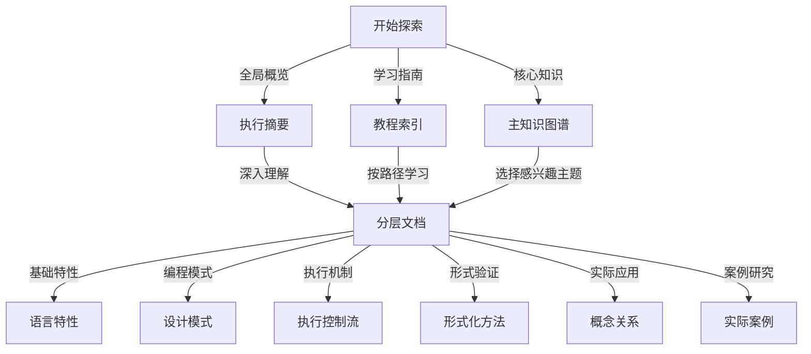

# Lean与Haskell知识图谱体系

## 📑 核心文档索引

### 📊 总览文档

- [**执行摘要**](/e:/_src/haskell/docs/refactor/meta/knowledge_graph/executive_summary.md) - 项目成果与价值概览
- [**教程索引**](/e:/_src/haskell/docs/refactor/meta/knowledge_graph/tutorial_index.md) - 详细学习路径与内容导航
- [**主知识图谱**](/e:/_src/haskell/docs/refactor/meta/knowledge_graph/lean_haskell_master_knowledge_graph.md) - 整合所有层次的核心知识

### 🔬 分层知识文档

#### 第一层: 语言特性层

- [**语言特性比较图谱**](/e:/_src/haskell/docs/refactor/meta/knowledge_graph/language_features_comparison.md) - 语言基础特性对比

#### 第二层: 设计模式层

- [**设计模式关系图谱**](/e:/_src/haskell/docs/refactor/meta/knowledge_graph/design_pattern_relationships.md) - 函数式设计模式分析

#### 第三层: 执行流与控制流层

- [**执行流与控制流分析**](/e:/_src/haskell/docs/refactor/meta/knowledge_graph/execution_control_flow.md) - 程序执行模型对比

#### 第四层: 形式化方法层

- [**形式化方法与验证模型分析**](/e:/_src/haskell/docs/refactor/meta/knowledge_graph/formal_methods_verification.md) - 形式规范与证明能力

#### 第五层: 应用实践层

- [**概念关系图谱**](/e:/_src/haskell/docs/refactor/meta/knowledge_graph/concept_relationships.md) - 核心概念映射与关联
- [**实际案例比较研究**](/e:/_src/haskell/docs/refactor/meta/knowledge_graph/case_studies_comparison.md) - 真实应用案例分析

### 📋 项目管理文档

- [**目录优化方案**](/e:/_src/haskell/docs/refactor/meta/knowledge_graph/directory_optimization_plan.md) - 知识架构组织方案
- [**完成报告**](/e:/_src/haskell/docs/refactor/meta/knowledge_graph/completion_report.md) - 项目完成情况总结

## 🎓 快速入门指南

## 🔍 如何使用本知识图谱

1. **初次访问**：首先阅读[执行摘要](/e:/_src/haskell/docs/refactor/meta/knowledge_graph/executive_summary.md)了解整体价值，然后查看[教程索引](/e:/_src/haskell/docs/refactor/meta/knowledge_graph/tutorial_index.md)选择适合的学习路径

2. **系统学习**：按照五层结构从基础到高级逐步学习，可参考[主知识图谱](/e:/_src/haskell/docs/refactor/meta/knowledge_graph/lean_haskell_master_knowledge_graph.md)了解整体框架

3. **专题研究**：直接访问感兴趣的专题文档，如设计模式、形式化方法等

4. **实践指导**：查阅[实际案例比较研究](/e:/_src/haskell/docs/refactor/meta/knowledge_graph/case_studies_comparison.md)了解真实应用经验

5. **概念理解**：通过[概念关系图谱](/e:/_src/haskell/docs/refactor/meta/knowledge_graph/concept_relationships.md)理解核心概念之间的联系

## 📚 主要知识点概览

| 知识类别 | 主要内容 | 适用人群 |
|--------|----------|---------|
| **语言特性** | 类型系统、语法结构、求值策略、模块机制 | 初学者、语言学习者 |
| **设计模式** | 函数式模式、抽象组合、类型驱动设计 | 开发者、架构师 |
| **执行控制** | 求值机制、副作用管理、并发模型 | 性能优化者、系统开发者 |
| **形式化方法** | 定理证明、类型安全、形式验证 | 研究人员、安全关键系统开发者 |
| **应用实践** | 案例分析、最佳实践、应用策略 | 项目经理、技术决策者 |

## 🔄 知识体系维护计划

- **季度更新**：每季度更新案例研究和最佳实践
- **半年审核**：每半年审核所有文档内容的准确性和时效性
- **年度扩展**：每年扩展知识体系，添加新的主题或深化现有内容

## 📥 反馈与贡献

我们欢迎各种形式的反馈和贡献，特别是：

- 内容准确性和完整性建议
- 新案例研究和最佳实践
- 文档结构和导航改进
- 额外资源和参考推荐

---

*本知识图谱体系由专业团队精心构建，旨在为Lean和Haskell学习和应用提供系统化指导。*
