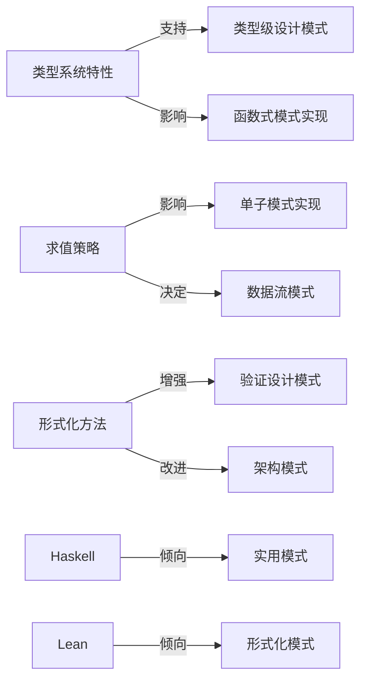
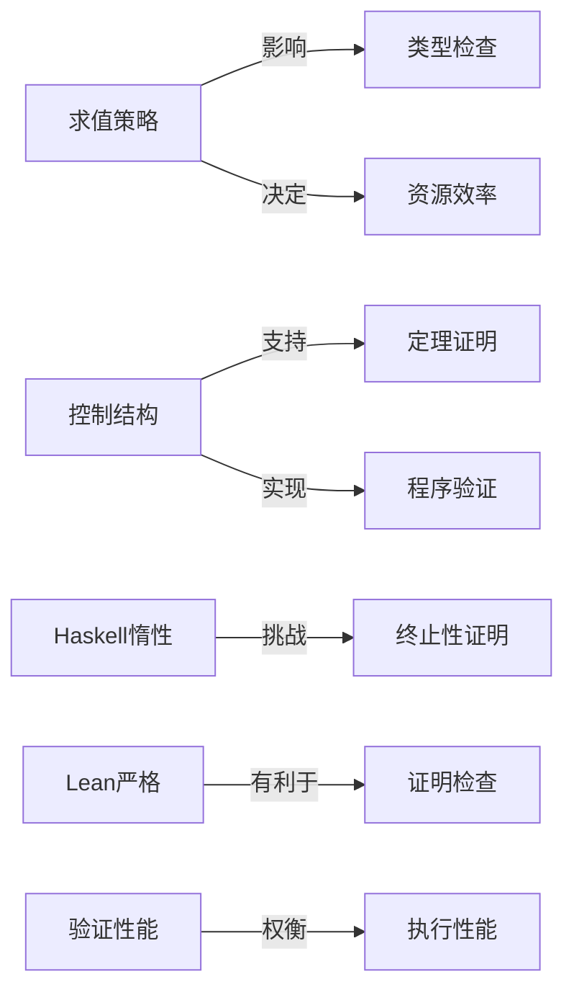
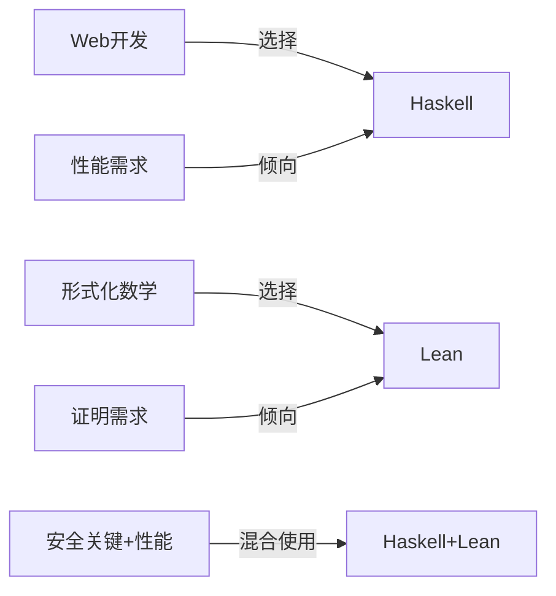

# Lean与Haskell主知识图谱

## 🎯 整合知识体系

本文档将之前创建的多个深度分析文档整合在一起，构建一个全面的Lean与Haskell知识图谱，涵盖语言特性、设计模式、执行流控制和形式化方法等多个维度，帮助开发者和研究人员从多角度全面理解这两种先进函数式语言的异同点和最佳应用场景。

## 📚 知识图谱层次结构

```mermaid
graph TB
    %% 顶层结构
    ROOT[Lean与Haskell知识体系] --> L1[语言特性层]
    ROOT --> L2[设计模式层]
    ROOT --> L3[执行流与控制流层]
    ROOT --> L4[形式化方法层]
    ROOT --> L5[应用实践层]
    
    %% 第一层：语言特性层
    L1 --> L1_1[类型系统特性]
    L1 --> L1_2[语法与表达式]
    L1 --> L1_3[编程范式支持]
    L1 --> L1_4[工具链与生态]
    
    %% 第二层：设计模式层
    L2 --> L2_1[函数式基础模式]
    L2 --> L2_2[高级函数式模式]
    L2 --> L2_3[架构设计模式]
    L2 --> L2_4[类型级设计模式]
    L2 --> L2_5[验证设计模式]
    
    %% 第三层：执行流与控制流层
    L3 --> L3_1[求值策略]
    L3 --> L3_2[控制结构]
    L3 --> L3_3[数据流处理]
    L3 --> L3_4[并发与并行]
    L3 --> L3_5[执行优化策略]
    
    %% 第四层：形式化方法层
    L4 --> L4_1[形式规范]
    L4 --> L4_2[定理证明]
    L4 --> L4_3[类型安全]
    L4 --> L4_4[程序验证]
    L4 --> L4_5[应用领域]
    
    %% 第五层：应用实践层
    L5 --> L5_1[软件工程实践]
    L5 --> L5_2[领域特定应用]
    L5 --> L5_3[教育与学习路径]
    L5 --> L5_4[语言融合与互操作]
    L5 --> L5_5[未来发展方向]
    
    %% 知识图谱文件链接
    L1 -.关联文档.-> DOC1[语言特性比较图谱]
    L2 -.关联文档.-> DOC2[设计模式关系图谱]
    L3 -.关联文档.-> DOC3[执行流与控制流分析]
    L4 -.关联文档.-> DOC4[形式化方法与验证模型分析]
    L5 -.关联文档.-> DOC5[概念关系图谱]
```



## 📝 知识图谱导航

### 1. 语言特性层次 (Language Features)

**参见详细文档：** [语言特性比较图谱](/e:/_src/haskell/docs/refactor/meta/knowledge_graph/language_features_comparison.md)

#### 核心比较维度

- **类型系统**：Haskell的Hindley-Milner类型系统与Lean的依赖类型系统
- **执行模型**：Haskell的惰性求值与Lean的严格求值策略
- **设计模式支持**：两种语言支持的函数式设计模式与架构模式
- **工具链与生态**：编译器、包管理、IDE支持等基础设施比较
- **应用领域**：各自最适合的应用场景和优势领域

#### 关键差异点

```text
Haskell: 更成熟的工业应用支持、默认惰性求值、丰富的库生态
Lean: 依赖类型系统、原生证明能力、形式化数学支持
```

### 2. 设计模式层次 (Design Patterns)

**参见详细文档：** [设计模式关系图谱](/e:/_src/haskell/docs/refactor/meta/knowledge_graph/design_pattern_relationships.md)

#### 核心设计模式类别

- **函数式基础模式**：值层次、函数层次、类型层次的基础模式
- **高级函数式模式**：函子、应用函子、单子等抽象容器模式
- **架构模式**：分层架构、事件驱动、管道-过滤架构等
- **类型级模式**：类型族、GADT、幻影类型、依赖类型模式等
- **验证模式**：类型保证、定理证明、不变量、属性测试模式等

#### 设计模式实现对比

```text
共性：两种语言都深度支持函数式编程核心模式
差异：Haskell在工程模式更成熟，Lean在验证模式更强大
互补：结合Haskell的实用性和Lean的验证能力
```

### 3. 执行流与控制流层次 (Execution & Control Flow)

**参见详细文档：** [执行流与控制流分析](/e:/_src/haskell/docs/refactor/meta/knowledge_graph/execution_control_flow.md)

#### 核心执行流比较

- **求值策略**：惰性求值 vs 严格求值的深入对比
- **控制结构**：函数式控制、模式匹配、递归结构的实现差异
- **数据流处理**：函数组合、管道、迭代抽象的实现机制
- **并发与并行**：两种语言中的并发抽象和并行处理模型
- **执行优化**：编译器优化策略与运行时性能特性

#### 关键执行特性对比

```text
Haskell优势：惰性求值使无限数据结构自然，并发模型成熟
Lean优势：严格求值使执行更可预测，终止性可静态保证
```

### 4. 形式化方法层次 (Formal Methods)

**参见详细文档：** [形式化方法与验证模型分析](/e:/_src/haskell/docs/refactor/meta/knowledge_graph/formal_methods_verification.md)

#### 核心形式化能力

- **形式规范**：规范表达机制、契约设计、不变量表达方式
- **定理证明**：证明系统能力、证明自动化、证明辅助工具
- **类型安全**：类型系统能力、静态保证、运行时检查机制
- **程序验证**：验证方法、属性测试、模型检验技术
- **应用领域**：形式化方法在不同领域的应用场景

#### 形式化方法对比

```text
Haskell方法：类型安全 + 属性测试 + 有限形式验证
Lean方法：依赖类型 + 定理证明 + 形式化验证
互补性：从测试驱动到证明驱动的渐进式方法
```

### 5. 应用实践层次 (Practical Applications)

**参见详细文档：** [概念关系图谱](/e:/_src/haskell/docs/refactor/meta/knowledge_graph/concept_relationships.md)

#### 核心应用实践

- **软件工程实践**：开发方法学、最佳实践、团队协作模式
- **领域特定应用**：各自最适合的应用领域与案例研究
- **教育与学习路径**：学习曲线、教学策略、入门路径
- **语言融合与互操作**：混合开发策略、互操作方法、工具链整合
- **未来发展方向**：理论与实践的融合、趋势预测

#### 应用场景选择指南

```text
选择Haskell的场景：工业级应用、性能关键系统、Web开发、大型团队
选择Lean的场景：形式化数学、安全关键系统、证明必要场景
混合使用场景：Lean做验证，Haskell做实现的混合方法
```

## 🔄 跨层次关联关系

### 特性-设计模式关联



### 执行流-形式化方法关联



### 应用场景-语言特性关联



## 📋 多维度对比总结

### 1. 语言哲学与设计目标

| 维度 | Haskell | Lean | 融合方向 |
|------|---------|------|---------|
| **核心理念** | 纯函数式编程 | 形式化数学与证明 | 可验证的函数式系统 |
| **设计重点** | 表达能力与性能 | 可证明性与数学严谨 | 兼顾实用性与正确性 |
| **发展方向** | 工程实践与类型扩展 | 数学基础与证明自动化 | 将形式方法引入主流开发 |
| **社区焦点** | 函数式编程、类型理论 | 定理证明、形式化数学 | 正确性与工程性的平衡 |

### 2. 学习与应用曲线

| 阶段 | Haskell | Lean | 建议学习策略 |
|------|---------|------|------------|
| **入门阶段** | 函数式基础、类型系统 | 依赖类型、证明基础 | Haskell先行，打好函数式基础 |
| **中级阶段** | 高级类型特性、设计模式 | 定理证明技巧、战术 | 并行学习，理解异同 |
| **高级阶段** | 类型级编程、性能优化 | 复杂证明、元编程 | 根据应用目标专注一个方向 |
| **专家阶段** | 语言实现、类型理论 | 类型论、数学形式化 | 两者融合，推动前沿 |

### 3. 工具链与资源比较

| 资源类型 | Haskell | Lean | 融合建议 |
|---------|---------|------|---------|
| **编译器** | GHC (成熟稳定) | Lean编译器 (发展中) | 共享LLVM后端优化 |
| **包管理** | Cabal/Stack (丰富) | Lake (发展中) | 互操作库规范 |
| **IDE支持** | 多种工具，HLS | 专用VSCode扩展 | 统一开发环境 |
| **社区资源** | 广泛书籍、教程、论坛 | 专业数学社区，文档 | 开发跨语言学习资源 |
| **库生态** | 庞大多样 | 数学库为主 | 构建验证库生态 |

### 4. 语言集成方向

| 集成层面 | 现状 | 发展机会 | 实现策略 |
|---------|------|---------|---------|
| **理论基础** | 共享函数式基础 | 类型理论的统一观点 | 类型理论研究与推广 |
| **工具互操作** | 有限支持 | 证明交换、代码生成 | 开发互操作标准与工具 |
| **开发方法学** | 分离发展 | 混合验证方法论 | 最佳实践文档与案例 |
| **教育路径** | 独立教学 | 整合课程 | 开发融合教材 |
| **应用实践** | 各自领域 | 互补优势应用 | 领域解决方案开发 |

## 📈 语言演化与趋势分析

### 1. 理论发展趋势

- **类型理论统一**：依赖类型进入主流函数式语言
- **证明辅助自动化**：AI辅助证明降低使用门槛
- **形式化方法普及**：轻量级形式化验证工具发展
- **语义模型融合**：执行模型与证明模型的统一

### 2. 工程实践趋势

- **验证驱动开发**：形式化与敏捷方法的融合
- **混合开发范式**：Lean验证+Haskell实现的工作流
- **安全关键应用**：形式化验证在关键领域的普及
- **形式化工具链**：形式化方法工具的集成与标准化

### 3. 教育与推广趋势

- **融合教学法**：从函数式到形式化的渐进式教学
- **可访问性提升**：降低形式化方法的学习门槛
- **工业培训增加**：形式化方法工业应用培训
- **社区互动增强**：函数式和形式化方法社区的交流

## 🚀 后续发展建议

1. **丰富知识图谱**：继续深化各层次的分析和关联
2. **实践案例开发**：创建混合使用两种语言的实例项目
3. **教学资源开发**：制作从Haskell到Lean的渐进式教程
4. **工具链整合**：推动开发互操作工具和共享标准
5. **社区推广**：促进两个社区的对话与合作

## 📚 总结与展望

Haskell和Lean代表了函数式编程世界的两个重要方向：一个侧重工程实践和表达能力，一个侧重形式化证明和数学严谨。通过本知识图谱的多层次分析和关联，我们不仅可以更全面地理解两种语言的异同点，还可以探索它们的互补性和融合可能，为未来程序设计语言的发展提供新的视角和方向。随着依赖类型系统的普及和形式化方法的发展，我们有理由期待一个兼具实用性和严谨性的编程范式逐渐成为主流。
