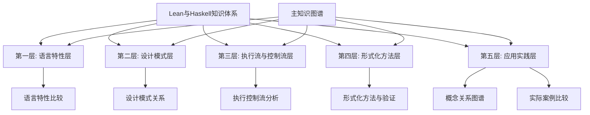

# Lean与Haskell知识图谱教程索引

## 🧭 概述

本索引文档为Lean与Haskell知识体系提供了结构化导航，帮助初学者和专业人士根据自身需求找到相关资源。知识图谱按照层次化结构组织，从基础语言特性到高级应用实践，覆盖了理论基础、设计模式、执行控制、形式化方法和实际案例等多个维度。

## 📚 五层知识体系结构

## 📑 文档清单与内容概览

### 1. 主知识图谱

- **[Lean与Haskell主知识图谱](/e:/_src/haskell/docs/refactor/meta/knowledge_graph/lean_haskell_master_knowledge_graph.md)**
  
  整合所有层次的核心知识，提供两种语言的全局视图和主要比较维度，是整个知识体系的入口和总览。

### 2. 语言特性层

- **[语言特性比较图谱](/e:/_src/haskell/docs/refactor/meta/knowledge_graph/language_features_comparison.md)**
  
  详细对比Lean和Haskell的基础语言特性，包括类型系统、语法结构、求值策略、模块化机制等，帮助理解两种语言的核心差异和共性。关键内容：
  
  - 类型系统对比（Hindley-Milner vs 依赖类型）
  - 语法结构比较（声明式语法、模式匹配等）
  - 核心语言机制（惰性求值、严格求值等）
  - 模块化与抽象机制

### 3. 设计模式层

- **[设计模式关系图谱](/e:/_src/haskell/docs/refactor/meta/knowledge_graph/design_pattern_relationships.md)**
  
  分析两种语言中的函数式设计模式实现方式、异同点和应用场景，探索设计思想的转换和映射关系。关键内容：
  
  - 函数式核心模式对比（函子、单子等）
  - 抽象和组合模式实现差异
  - 类型驱动设计模式
  - 领域特定模式

### 4. 执行流与控制流层

- **[执行流与控制流分析](/e:/_src/haskell/docs/refactor/meta/knowledge_graph/execution_control_flow.md)**
  
  深入分析两种语言的程序执行模型、控制流机制、异常处理和并发模型等，解释背后的理论基础和实际影响。关键内容：
  
  - 求值策略深度分析
  - 控制流结构对比
  - 副作用管理机制
  - 并发与并行模型
  - 性能特征分析

### 5. 形式化方法层

- **[形式化方法与验证模型分析](/e:/_src/haskell/docs/refactor/meta/knowledge_graph/formal_methods_verification.md)**
  
  比较两种语言在形式规范、定理证明、类型安全和验证能力方面的特点，探讨如何利用这些能力构建可靠软件。关键内容：
  
  - 形式规范表达能力
  - 定理证明能力对比
  - 类型安全保证机制
  - 验证工具和方法论
  - 形式化方法应用策略

### 6. 应用实践层

- **[概念关系图谱](/e:/_src/haskell/docs/refactor/meta/knowledge_graph/concept_relationships.md)**
  
  构建Lean和Haskell核心概念之间的关系图谱，展示概念映射、转换通道和交互方式，帮助构建完整的心智模型。关键内容：
  
  - 核心概念映射关系
  - 语义等价结构
  - 概念转换通道
  - 思维模型对比

- **[实际案例比较研究](/e:/_src/haskell/docs/refactor/meta/knowledge_graph/case_studies_comparison.md)**
  
  通过真实案例比较两种语言在不同应用场景中的表现，总结最佳实践和经验教训，提供实际应用指导。关键内容：
  
  - 安全关键系统案例
  - Web开发案例
  - 科学计算案例
  - 教育与研究案例
  - 开发工具案例
  - 最佳实践总结

### 7. 辅助文档

- **[目录优化方案](/e:/_src/haskell/docs/refactor/meta/knowledge_graph/directory_optimization_plan.md)**
  
  提供知识体系的目录结构优化建议，确保内容组织合理、易于导航和扩展。

- **[完成报告](/e:/_src/haskell/docs/refactor/meta/knowledge_graph/completion_report.md)**
  
  总结知识图谱构建过程、成果和后续发展建议，记录项目进展。

## 🎯 学习路径建议

### 初学者路径

1. 先阅读主知识图谱获得整体观
2. 深入语言特性比较了解基础差异
3. 通过案例研究理解实际应用
4. 学习设计模式关系掌握编程思想
5. 探索执行流分析理解深层机制

### 专业人士路径

1. 直接探索形式化方法与验证模型
2. 通过概念关系图谱构建完整心智模型
3. 深入设计模式关系掌握高级抽象
4. 分析高级案例研究实际应用策略

### 特定目标路径

- **验证专家**: 形式化方法 → 执行流分析 → 案例研究
- **语言设计者**: 语言特性 → 设计模式 → 概念关系
- **工程实践者**: 案例研究 → 设计模式 → 执行流分析

## 📖 如何使用本知识图谱

1. **入门探索**: 从主知识图谱开始，了解整体框架和关键维度
2. **深入学习**: 选择感兴趣的层次，系统学习相关文档
3. **实践应用**: 结合案例研究和最佳实践，应用到实际项目
4. **概念关联**: 利用概念关系图谱建立交叉连接的理解
5. **参考查询**: 在实践中遇到问题时，查询相关主题获取答案

## 🔄 知识图谱更新计划

本知识体系将持续更新和完善，计划中的扩展方向：

1. **交互式学习资源**: 添加可交互的代码示例和练习
2. **视频教程链接**: 补充相关视频资源的引用
3. **社区资源整合**: 引入更多社区贡献的最佳实践
4. **工具链指南**: 详细的开发环境和工具配置指南
5. **领域专题**: 针对特定应用领域的深度指南

## 📥 反馈与贡献

我们欢迎对知识图谱的反馈和贡献，特别是在以下方面：

- 内容准确性和完整性建议
- 新案例研究和最佳实践
- 文档结构和导航改进
- 额外资源和参考推荐

请通过项目仓库提交问题或贡献，帮助我们不断改进这个知识体系。
