# Lean与Haskell增强知识图谱：软件设计与形式模型的深度整合

## 1. 知识图谱概述

本知识图谱整合了Lean和Haskell在软件设计模式、应用模型、形式模型、执行流、控制流、数据流等方面的关联性分析，消除重复内容，构建全面且深入的知识体系。

## 2. 核心概念关系图

```mermaid
graph TB
    %% 主要领域节点
    ROOT[Lean与Haskell知识体系] --> THEORY[理论基础]
    ROOT --> DESIGN[设计模式]
    ROOT --> MODELS[应用与形式模型]
    ROOT --> FLOW[执行与数据流]
    ROOT --> PRACTICE[实践应用]
    ROOT --> INTEGRATION[语言集成]

    %% 理论基础分支
    THEORY --> TH1[语言范式]
    THEORY --> TH2[类型系统]
    THEORY --> TH3[计算模型]
    THEORY --> TH4[范畴论]

    %% 类型系统详细展开
    TH2 --> TH2_1[Haskell类型系统]
    TH2 --> TH2_2[Lean依赖类型]
    TH2_1 --> TH2_1_1[Hindley-Milner类型推导]
    TH2_1 --> TH2_1_2[类型类与多态]
    TH2_1 --> TH2_1_3[高级类型特性]
    TH2_2 --> TH2_2_1[依赖类型基础]
    TH2_2 --> TH2_2_2[命题即类型]
    TH2_2 --> TH2_2_3[归纳类型族]

    %% 设计模式分支
    DESIGN --> DS1[函数式模式]
    DESIGN --> DS2[架构模式]
    DESIGN --> DS3[创建型模式]
    DESIGN --> DS4[结构型模式]
    DESIGN --> DS5[行为型模式]

    %% 函数式模式详细展开
    DS1 --> DS1_1[单子模式]
    DS1 --> DS1_2[函子模式]
    DS1 --> DS1_3[应用函子]
    DS1 --> DS1_4[自由模式]
    DS1_1 --> DS1_1_1[Haskell单子]
    DS1_1 --> DS1_1_2[Lean单子]
    DS1_1_1 --> DS1_1_1_1[IO单子]
    DS1_1_1 --> DS1_1_1_2[State单子]
    DS1_1_1 --> DS1_1_1_3[Either单子]
    DS1_1_2 --> DS1_1_2_1[IO单子]
    DS1_1_2 --> DS1_1_2_2[证明单子]

    %% 应用与形式模型分支
    MODELS --> MD1[领域特定语言]
    MODELS --> MD2[系统集成模型]
    MODELS --> MD3[类型理论模型]
    MODELS --> MD4[语义模型]

    %% 领域特定语言详细展开
    MD1 --> MD1_1[Haskell DSL]
    MD1 --> MD1_2[Lean DSL]
    MD1_1 --> MD1_1_1[解析器组合子]
    MD1_1 --> MD1_1_2[配置DSL]
    MD1_1 --> MD1_1_3[业务规则DSL]
    MD1_2 --> MD1_2_1[数学DSL]
    MD1_2 --> MD1_2_2[证明DSL]
    MD1_2 --> MD1_2_3[形式化规范DSL]

    %% 执行与数据流分支
    FLOW --> FL1[求值策略]
    FLOW --> FL2[控制结构]
    FLOW --> FL3[数据流处理]
    FLOW --> FL4[并发模型]

    %% 求值策略详细展开
    FL1 --> FL1_1[Haskell惰性求值]
    FL1 --> FL1_2[Lean严格求值]
    FL1_1 --> FL1_1_1[惰性优势]
    FL1_1 --> FL1_1_2[惰性挑战]
    FL1_2 --> FL1_2_1[严格优势]
    FL1_2 --> FL1_2_2[严格挑战]

    %% 实践应用分支
    PRACTICE --> PR1[系统开发]
    PRACTICE --> PR2[科学计算]
    PRACTICE --> PR3[形式验证]
    PRACTICE --> PR4[安全关键系统]

    %% 语言集成分支
    INTEGRATION --> INT1[技术选择]
    INTEGRATION --> INT2[混合开发]
    INTEGRATION --> INT3[学习路径]
    INTEGRATION --> INT4[最佳实践]

    %% 关系展示
    DS1_1 --共享概念--> TH4
    DS1_2 --共享概念--> TH4
    TH2_2 --支持--> PR3
    FL1 --影响--> PR1
    INT2 --结合--> PR4
    TH2_1 --应用于--> DS1
    TH2_2 --应用于--> DS1
    MD3 --理论基础--> TH2
    MD4 --理论基础--> TH3
```



## 3. 理论基础深度整合

### 3.1 类型系统对比

| 类型系统特性 | Haskell | Lean | 整合价值 |
|------------|---------|------|---------|
| **基本类型系统** | 静态强类型，Hindley-Milner类型推导 | 依赖类型系统，基于直觉类型论 | 结合类型推导与依赖类型 |
| **多态机制** | 参数多态，类型类多态 | 依赖多态，类型类多态 | 多层次多态支持 |
| **高级类型特性** | GADTs，类型族，多参数类型类 | 归纳类型族，依赖记录类型 | 强大的类型级编程 |
| **类型安全** | 编译时类型检查 | 编译时类型检查与证明 | 多层次类型安全保证 |

### 3.2 计算模型对比

| 计算特性 | Haskell | Lean | 整合价值 |
|---------|---------|------|---------|
| **求值策略** | 惰性求值（非严格） | 严格求值 | 按场景选择最佳策略 |
| **副作用处理** | 单子封装 | 单子与依赖类型 | 类型安全的副作用处理 |
| **并发模型** | 轻量级线程，STM | 类型安全并发 | 结合性能与安全性 |
| **内存管理** | 垃圾回收 | 垃圾回收 | 自动内存管理 |

### 3.3 范畴论基础

```haskell
-- Haskell中的范畴论概念
class Functor f where
    fmap :: (a -> b) -> f a -> f b

class Applicative f => Monad f where
    return :: a -> f a
    (>>=) :: f a -> (a -> f b) -> f b
```

```lean
-- Lean中的范畴论概念
class Functor (f : Type → Type) where
    map : {α β : Type} → (α → β) → f α → f β

class Monad (m : Type → Type) extends Functor m where
    pure : α → m α
    bind : m α → (α → m β) → m β
```

## 4. 设计模式深度整合

### 4.1 函数式设计模式

#### 4.1.1 单子模式深度对比

**Haskell单子实现：**

```haskell
-- State单子
newtype State s a = State { runState :: s -> (a, s) }

instance Monad (State s) where
    return a = State $ \s -> (a, s)
    m >>= k = State $ \s -> 
        let (a, s') = runState m s
        in runState (k a) s'

-- 使用示例
calculateWithState :: State Int Int
calculateWithState = do
    current <- get
    put (current + 1)
    return (current * 2)
```

**Lean单子实现：**

```lean
-- State单子
def State (s a : Type) : Type := s → a × s

def return {s a : Type} (x : a) : State s a :=
λ st, (x, st)

def bind {s a b : Type} (m : State s a) (f : a → State s b) : State s b :=
λ st, 
  let (x, st') := m st
  f x st'

-- 使用示例
def calculateWithState : State Nat Nat :=
  bind get (λ current =>
  bind (put (current + 1)) (λ _ =>
  return (current * 2)))
```

**深度关联分析：**

1. **概念映射**：两种语言的单子概念直接对应
2. **实现差异**：Lean的实现更注重类型安全和形式化
3. **使用模式**：Haskell的do表示法更简洁，Lean的证明能力更强
4. **适用场景**：Haskell适合实际开发，Lean适合形式化验证

### 4.2 架构模式整合

| 架构模式 | Haskell实现 | Lean实现 | 整合最佳实践 |
|---------|------------|----------|-------------|
| **分层架构** | 单子变换器堆栈 | 依赖类型层次 | 类型安全的分层架构 |
| **事件驱动** | FRP、事件流 | 类型安全事件处理 | 可验证的事件系统 |
| **微服务** | 服务类型类 | 形式化服务接口 | 形式化微服务架构 |
| **六边形架构** | 端口与适配器 | 类型安全接口 | 可验证的领域模型 |

### 4.3 创建型模式对比

**工厂模式对比：**

```haskell
-- Haskell工厂模式
class Factory f where
    create :: f -> Product

data ProductFactory = ProductFactory

instance Factory ProductFactory where
    create _ = Product
```

```lean
-- Lean工厂模式
class Factory (α : Type) where
    create : α → Product

structure ProductFactory where

instance : Factory ProductFactory where
    create _ := Product

-- 类型安全工厂
theorem factory_correct (f : ProductFactory) :
    (create f).valid :=
by constructor
```

## 5. 应用与形式模型深度整合

### 5.1 领域特定语言(DSL)整合

#### 5.1.1 解析器DSL对比

**Haskell解析器DSL：**

```haskell
-- 解析器组合子
newtype Parser a = Parser { parse :: String -> [(a, String)] }

instance Functor Parser where
    fmap f (Parser p) = Parser $ \s -> [(f a, s') | (a, s') <- p s]

instance Applicative Parser where
    pure a = Parser $ \s -> [(a, s)]
    Parser f <*> Parser p = Parser $ \s -> 
        [(g a, s'') | (g, s') <- f s, (a, s'') <- p s']

-- 简单解析器
digit :: Parser Char
digit = Parser $ \s -> case s of
    (c:cs) | isDigit c -> [(c, cs)]
    _                  -> []
```

**Lean解析器DSL：**

```lean
-- 解析器类型
def Parser (α : Type) : Type := String → Option (α × String)

-- 函子实例
def map {α β : Type} (f : α → β) (p : Parser α) : Parser β :=
λ s => match p s with
  | none => none
  | some (a, s') => some (f a, s')

-- 应用函子实例
def pure {α : Type} (a : α) : Parser α :=
λ s => some (a, s)

def seq {α β : Type} (f : Parser (α → β)) (p : Parser α) : Parser β :=
λ s => match f s with
  | none => none
  | some (g, s') => match p s' with
    | none => none
    | some (a, s'') => some (g a, s'')

-- 简单解析器
def digit : Parser Char :=
λ s => match s.front? with
  | none => none
  | some c => if c.isDigit then some (c, s.drop 1) else none
```

### 5.2 类型理论模型整合

| 类型理论概念 | Haskell实现 | Lean实现 | 整合价值 |
|------------|------------|----------|---------|
| **多态** | 参数多态，类型类 | 依赖多态，类型类 | 多层次多态支持 |
| **类型构造** | 类型构造器，GADT | 归纳类型，依赖类型 | 强大的类型级编程 |
| **类型推断** | Hindley-Milner | 依赖类型推断 | 平衡易用性与表达力 |
| **类型安全** | 强类型检查 | 定理证明 | 多层次类型安全 |

### 5.3 语义模型整合

**Haskell语义模型：**

```haskell
-- 指称语义
-- 纯函数语义
f :: Int -> Int
f x = x + 1

-- 单子语义
newtype State s a = State { runState :: s -> (a, s) }

-- 操作语义
-- 惰性求值
ones :: [Int]
ones = 1 : ones
```

**Lean语义模型：**

```lean
-- 指称语义
-- 纯函数语义
def f (x : Nat) : Nat := x + 1

-- 状态语义
def State (s a : Type) : Type := s → a × s

-- 证明语义
theorem function_correctness (x : Nat) :
    f x = x + 1 :=
by rfl
```

## 6. 执行与数据流深度整合

### 6.1 求值策略深度对比

| 求值特性 | Haskell | Lean | 整合价值 |
|---------|---------|------|---------|
| **默认策略** | 惰性求值（非严格） | 严格求值 | 按场景选择策略 |
| **内存效率** | 可能造成空间泄漏 | 可预测的内存使用 | 优化内存管理 |
| **无限数据** | 原生支持无限列表 | 需要特殊处理 | 结合两种方式优势 |
| **并行性** | 惰性会影响并行 | 更适合并行化 | 针对场景选择模型 |

### 6.2 控制结构深度对比

**Haskell控制结构：**

```haskell
-- 模式匹配
processValue :: Maybe Int -> String
processValue Nothing = "No value"
processValue (Just x)
    | x < 0     = "Negative"
    | x == 0    = "Zero"
    | otherwise = "Positive"

-- 递归
factorial :: Integer -> Integer
factorial 0 = 1
factorial n = n * factorial (n - 1)
```

**Lean控制结构：**

```lean
-- 模式匹配
def processValue : Option Nat → String
| none   => "No value"
| some x => match x with
    | 0     => "Zero"
    | n + 1 => "Positive"

-- 递归
def factorial : Nat → Nat
| 0 => 1
| n + 1 => (n + 1) * factorial n

-- 证明终止性
theorem factorial_terminates (n : Nat) :
    factorial n ≥ 1 :=
by induction n with
| zero => rfl
| succ n ih => simp [factorial]; apply Nat.mul_le_mul; exact Nat.succ_pos n; exact ih
```

### 6.3 数据流处理深度对比

**Haskell数据流：**

```haskell
-- 管道数据流
(>>>) :: (a -> b) -> (b -> c) -> (a -> c)
f >>> g = g . f

-- 流式数据流
data Stream a = Cons a (Stream a)

mapStream :: (a -> b) -> Stream a -> Stream b
mapStream f (Cons x xs) = Cons (f x) (mapStream f xs)
```

**Lean数据流：**

```lean
-- 管道数据流
def pipe {α β γ : Type} (f : α → β) (g : β → γ) : α → γ :=
fun x => g (f x)

-- 流式数据流
inductive Stream (α : Type) : Type
| cons : α → Stream α → Stream α

def mapStream {α β : Type} (f : α → β) : Stream α → Stream β
| Stream.cons x xs => Stream.cons (f x) (mapStream f xs)

-- 类型安全数据流
theorem map_preserves_structure {α β : Type} (f : α → β) (s : Stream α) :
    (mapStream f s).length = s.length :=
by induction s with
| cons x xs ih => simp [mapStream, length]; rw ih
```

## 7. 实践应用整合

### 7.1 应用场景匹配

| 应用领域 | 最适合的语言 | 原因 | 互补整合方式 |
|---------|------------|------|-------------|
| **Web开发** | Haskell | 生态系统成熟、性能优化 | Lean验证关键算法 |
| **形式化验证** | Lean | 内置证明系统 | Haskell实现经验证算法 |
| **数据处理** | Haskell | 流处理库丰富 | Lean保证算法正确性 |
| **安全关键系统** | Lean+Haskell | 形式验证+工程实践 | 混合开发方法论 |

### 7.2 实际案例分析

#### 7.2.1 类型安全数据处理系统

**问题**：需要处理复杂数据转换，同时保证转换的正确性。

**解决方案**：

```haskell
-- Haskell实现
data ProcessingConfig = ...
data InputData = ...
data OutputData = ...

processData :: ProcessingConfig -> InputData -> Either Error OutputData
processData config input = do
    validated <- validateInput input
    transformed <- applyTransformations config validated
    pure transformed
```

```lean
-- Lean正确性证明
theorem processData_correct (config : ProcessingConfig) (input : InputData) :
    validInput input → 
    match processData config input with
    | error _ => false
    | success output => validOutput output
```

## 8. 语言集成深度指南

### 8.1 技术选择决策框架

| 需求维度 | 偏向Haskell | 偏向Lean | 混合使用 |
|---------|------------|---------|---------|
| **开发速度** | ✓ | | |
| **生态系统** | ✓ | | |
| **形式验证** | | ✓ | |
| **安全保证** | | ✓ | |
| **性能优化** | ✓ | | |
| **团队经验** | 取决于团队背景 | 取决于团队背景 | ✓ |
| **项目规模** | 大型项目 | 小型关键组件 | 大型+关键保证 |

### 8.2 混合开发最佳实践

1. **接口契约验证**：使用Lean定义和验证接口契约，使用Haskell实现
2. **核心算法验证**：关键算法在Lean中证明正确性，在Haskell中实现高效版本
3. **分层架构**：底层核心组件使用Lean保证正确性，上层应用逻辑使用Haskell
4. **渐进式采用**：从Haskell开始，逐步将关键部分移至Lean进行验证

### 8.3 学习路径整合

#### 8.3.1 从Haskell到Lean

1. **掌握Haskell基础**：类型系统、类型类、单子
2. **学习范畴论概念**：函子、自然变换、单子
3. **理解依赖类型**：Lean的类型系统
4. **学习证明技巧**：归纳证明、等式推理
5. **实践形式化验证**：程序正确性证明

#### 8.3.2 从Lean到Haskell

1. **掌握Lean基础**：依赖类型、归纳类型、证明
2. **学习软件工程实践**：模块化、测试、性能
3. **理解Haskell类型系统**：类型推导、类型类、GADT
4. **学习惰性求值**：惰性求值策略与模式
5. **实践Haskell生态系统**：库和框架

## 9. 未来发展方向

1. **更紧密的语言互操作**：改进Haskell和Lean之间的互操作性
2. **共享证明与实现**：从一种语言的形式化规范自动生成另一种语言的实现
3. **混合构建系统**：统一的构建系统，支持两种语言的混合项目
4. **验证模式库**：常见软件模式的形式化验证库
5. **领域特定语言**：构建连接两种语言优势的领域特定语言

## 10. 总结

本知识图谱通过深度整合Lean和Haskell在软件设计、设计模式、应用模型、形式模型、执行流、控制流、数据流等方面的关联性，消除了重复内容，构建了全面且深入的知识体系。这种整合不仅有助于理解两种语言的异同点，还为技术选择和混合开发提供了实践指导。

通过理解这两种语言的互补性，开发者可以根据项目需求做出更明智的技术选择，并在实践中结合两种语言的优势，构建既高效又可靠的软件系统。
