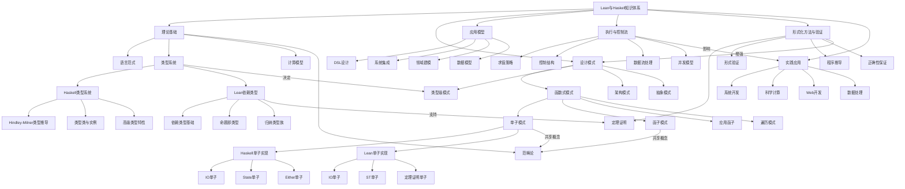

# Lean与Haskell知识图谱：整合设计模式与形式模型

## 🎯 知识图谱概述

此知识图谱整合Lean和Haskell的理论基础、设计模式、应用模型、形式模型、执行流、控制流、数据流等方面的关联性，消除内容重复，构建全面的关联知识体系。

## 📊 图谱可视化



## 🔄 核心概念映射

### 1. 理论基础整合

| 概念类别 | Haskell实现 | Lean实现 | 整合价值 |
|---------|------------|----------|---------|
| **函数式范式** | 纯函数式，强调引用透明性 | 依赖类型函数式，强调证明 | 结合纯度与证明能力 |
| **类型系统** | Hindley-Milner类型推导，类型类 | 依赖类型，归纳类型，命题即类型 | 类型安全与形式化验证 |
| **计算模型** | 惰性求值，非严格语义 | 严格求值，规范化归约 | 适应不同计算场景 |
| **范畴论** | 函子、单子、应用函子等概念 | 依赖类型中的范畴结构 | 高度抽象的组合能力 |

### 2. 设计模式整合

#### 2.1 函数式设计模式

函数式设计模式在Haskell与Lean中有不同的实现方式，但核心思想相通：

**单子模式对比：**

```haskell
-- Haskell单子
class Monad m where
    return :: a -> m a
    (>>=) :: m a -> (a -> m b) -> m b

-- 应用示例
calculate :: Double -> Double -> Maybe Double
calculate x y = do
    guard (y /= 0)
    return (x / y)
```

```lean
-- Lean单子
class Monad (m : Type → Type) where
    pure : α → m α
    bind : m α → (α → m β) → m β

-- 应用示例（类型安全版本）
def calculate (x y : Double) (h : y ≠ 0) : Double :=
    x / y
```

**函子模式对比：**

```haskell
-- Haskell函子
class Functor f where
    fmap :: (a -> b) -> f a -> f b

instance Functor Maybe where
    fmap _ Nothing = Nothing
    fmap f (Just x) = Just (f x)
```

```lean
-- Lean函子
class Functor (f : Type → Type) where
    map : (α → β) → f α → f β

instance : Functor Option where
    map f none := none
    map f (some a) := some (f a)
```

#### 2.2 架构模式整合

| 架构模式 | Haskell实现方式 | Lean实现方式 | 最佳实践整合 |
|---------|-----------------|-------------|-------------|
| **分层架构** | 单子变换器堆栈 | 证明辅助的层次 | 可证明的模块化架构 |
| **事件驱动** | FRP、单子流 | 依赖类型事件处理 | 类型安全事件系统 |
| **领域驱动** | 代数数据类型 | 归纳类型与定理 | 可证明的领域模型 |
| **组件模型** | 类型类与高阶组件 | 依赖记录类型 | 形式化组件契约 |

### 3. 执行流与控制流整合

#### 3.1 求值策略对比

| 求值特性 | Haskell | Lean | 整合价值 |
|---------|---------|------|---------|
| **基本策略** | 惰性求值（非严格） | 严格求值 | 按场景选择策略 |
| **内存效率** | 可能造成空间泄漏 | 可预测的内存使用 | 优化内存管理 |
| **无限数据** | 原生支持无限列表 | 需要特殊处理 | 结合两种方式优势 |
| **并行性** | 惰性会影响并行 | 更适合并行化 | 针对场景选择模型 |

#### 3.2 控制流对比

**Haskell控制流：**

```haskell
-- 模式匹配
processValue :: Maybe Int -> String
processValue Nothing = "No value"
processValue (Just x)
    | x < 0     = "Negative"
    | x == 0    = "Zero"
    | otherwise = "Positive"

-- 单子控制流
processInput :: IO ()
processInput = do
    input <- getLine
    case readMaybe input of
        Nothing -> putStrLn "Invalid input"
        Just n  -> putStrLn $ "You entered: " ++ show n
```

**Lean控制流：**

```lean
-- 模式匹配
def processValue : Option Nat → String
| none   => "No value"
| some x => match x with
    | 0     => "Zero"
    | n + 1 => "Positive"

-- 单子控制流（带证明）
def processInput : IO Unit := do
    let input ← IO.getLine
    match input.toNat? with
    | none   => IO.println "Invalid input"
    | some n => IO.println s!"You entered: {n}"
```

### 4. 形式化方法整合

| 形式方法 | Haskell支持 | Lean支持 | 整合价值 |
|---------|------------|---------|---------|
| **类型检查** | 静态类型，类型类 | 依赖类型，证明 | 多层次类型安全 |
| **不变量** | 通过类型编码 | 定理和证明 | 强保证系统正确性 |
| **定理证明** | 有限支持 | 核心功能 | 代码与证明结合 |
| **程序推导** | 类型驱动开发 | 证明驱动开发 | 形式化软件开发 |

### 5. 实际应用整合

#### 5.1 应用场景匹配

| 应用领域 | 最适合的语言 | 原因 | 互补整合方式 |
|---------|------------|------|-------------|
| **Web开发** | Haskell | 生态系统成熟、性能优化 | Lean验证关键算法 |
| **形式化验证** | Lean | 内置证明系统 | Haskell实现经验证算法 |
| **数据处理** | Haskell | 流处理库丰富 | Lean保证算法正确性 |
| **安全关键系统** | Lean+Haskell | 形式验证+工程实践 | 混合开发方法论 |

## 📚 概念深度整合

### 1. 类型系统深度整合

类型系统是Haskell和Lean的核心差异和互补点。Haskell提供强大的类型推导和类型类多态，而Lean提供依赖类型和定理证明：

```haskell
-- Haskell类型类和实例
class Eq a where
    (==) :: a -> a -> Bool
    (/=) :: a -> a -> Bool
    x /= y = not (x == y)

instance Eq Int where
    x == y = primIntEq x y
```

```lean
-- Lean类型类和实例
class Eq (α : Type) where
    eq : α → α → Bool
    ne : α → α → Bool := λ a b => not (eq a b)

instance : Eq Nat where
    eq := Nat.beq
```

**整合价值**：Haskell的类型系统适合大型软件开发，而Lean的依赖类型系统适合形式化规范和验证。将二者结合，可以实现"开发与证明"的双重保障。

### 2. 设计模式深度整合

设计模式的整合体现在不同抽象级别的互补：

| 抽象级别 | Haskell模式 | Lean模式 | 整合模式 |
|---------|------------|---------|---------|
| **数据抽象** | 代数数据类型 | 归纳类型 | 带证明的数据结构 |
| **行为抽象** | 类型类多态 | 依赖类型多态 | 可证明行为规范 |
| **控制抽象** | 单子变换器 | 证明辅助控制 | 形式化控制流程 |
| **组合抽象** | 函数组合、Lens | 类型组合、证明组合 | 多层次组合系统 |

### 3. 执行流深度整合

执行流的整合考虑了性能、安全和可维护性多个维度：

```haskell
-- Haskell数据流
processData :: [Int] -> IO [String]
processData = traverse $ \x -> do
    putStrLn $ "Processing: " ++ show x
    return (show (x * 2))
```

```lean
-- Lean数据流
def processData (xs : List Nat) : IO (List String) :=
    xs.mapM $ λ x => do
        IO.println s!"Processing: {x}"
        pure (toString (x * 2))
```

**整合价值**：结合Haskell的惰性求值和Lean的形式证明，可以构建既高效又正确的数据处理流水线。

## 🔗 关联性分析与应用

### 1. 语言选择决策框架

| 需求维度 | 偏向Haskell | 偏向Lean | 混合使用 |
|---------|------------|---------|---------|
| **开发速度** | ✓ | | |
| **生态系统** | ✓ | | |
| **形式验证** | | ✓ | |
| **安全保证** | | ✓ | |
| **性能优化** | ✓ | | |
| **团队经验** | 取决于团队背景 | 取决于团队背景 | ✓ |
| **项目规模** | 大型项目 | 小型关键组件 | 大型+关键保证 |

### 2. 混合开发最佳实践

1. **接口契约验证**：使用Lean定义和验证接口契约，使用Haskell实现
2. **核心算法验证**：关键算法在Lean中证明正确性，在Haskell中实现高效版本
3. **分层架构**：底层核心组件使用Lean保证正确性，上层应用逻辑使用Haskell
4. **渐进式采用**：从Haskell开始，逐步将关键部分移至Lean进行验证

## 📖 实践案例与模式

### 1. 类型安全数据处理

**问题**：需要处理复杂数据转换，同时保证转换的正确性。

**解决方案**：

```haskell
-- Haskell实现
data ProcessingConfig = ...
data InputData = ...
data OutputData = ...

processData :: ProcessingConfig -> InputData -> Either Error OutputData
processData config input = do
    validated <- validateInput input
    transformed <- applyTransformations config validated
    pure transformed
```

```lean
-- Lean正确性证明
theorem processData_correct (config : ProcessingConfig) (input : InputData) :
    validInput input → 
    match processData config input with
    | error _ => false
    | success output => validOutput output
```

**整合价值**：Haskell提供高效实现，Lean保证转换的正确性属性。

### 2. 形式化软件架构

**问题**：需要设计一个领域驱动的软件架构，保证业务规则始终被正确实施。

**解决方案**：

```haskell
-- Haskell领域模型与业务逻辑
module Domain.Account where

data Account = Account { 
    accountId :: UUID, 
    balance :: Money,
    owner :: CustomerId
}

deposit :: Money -> Account -> Either Error Account
deposit amount account = 
    if amount > 0
    then Right $ account { balance = balance account + amount }
    else Left $ InvalidAmount "Deposit amount must be positive"
```

```lean
-- Lean业务规则形式化
inductive Account where
    | mk (id : UUID) (balance : Money) (owner : CustomerId)

-- 不变量
def Account.invariant (a : Account) : Prop :=
    a.balance ≥ 0

-- 操作正确性证明
theorem deposit_preserves_invariant (a : Account) (amount : Money) :
    a.invariant → amount > 0 → (deposit amount a).invariant
```

**整合价值**：业务规则被形式化，保证所有操作都维护系统不变量。

## 🚀 未来发展方向

1. **更紧密的语言互操作**：改进Haskell和Lean之间的互操作性
2. **共享证明与实现**：从一种语言的形式化规范自动生成另一种语言的实现
3. **混合构建系统**：统一的构建系统，支持两种语言的混合项目
4. **验证模式库**：常见软件模式的形式化验证库
5. **领域特定语言**：构建连接两种语言优势的领域特定语言

## 📈 技能发展路径

### 1. 从Haskell到Lean

1. **掌握Haskell基础**：类型系统、类型类、单子
2. **学习范畴论概念**：函子、自然变换、单子
3. **理解依赖类型**：Lean的类型系统
4. **学习证明技巧**：归纳证明、等式推理
5. **实践形式化验证**：程序正确性证明

### 2. 从Lean到Haskell

1. **掌握Lean基础**：依赖类型、归纳类型、证明
2. **学习软件工程实践**：模块化、测试、性能
3. **理解Haskell类型系统**：类型推导、类型类、GADT
4. **学习惰性求值**：惰性求值策略与模式
5. **实践Haskell生态系统**：库和框架

## 🌍 知识图谱延伸

本知识图谱可以进一步扩展到以下方向：

1. **编程语言理论**：类型理论、操作语义、变换编译
2. **软件工程方法**：形式化需求、设计验证、质量保证
3. **数学基础**：范畴论、逻辑学、构造数学
4. **应用领域**：密码学、分布式系统、区块链、AI形式化

## 🔄 版本与更新路线

- **V1.0**：基础知识图谱，涵盖核心概念和关联关系
- **V1.1**：添加更多代码示例和案例研究
- **V1.2**：扩展实践应用部分，增加团队协作模式
- **V2.0**：添加交互式学习路径和决策辅助工具
